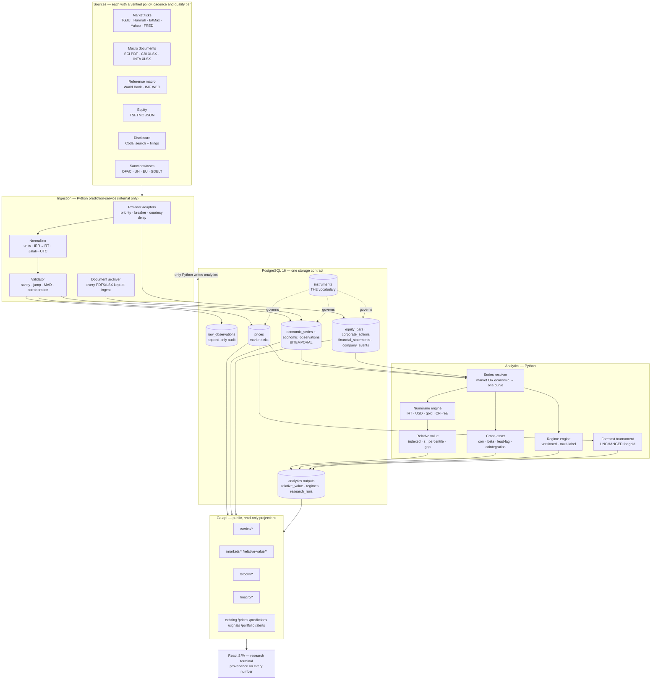

# tala-pala → Iran Macro & Multi-Asset Intelligence Platform

**Design review, 2026-09-08.** Author: architecture pass over the working system at commit `4f21859`.
Status: **design accepted for P0 implementation**; P1–P5 gated on the data findings in section D.

This document is binding in the same way `docs/CONTRACTS.md` is. Where it contradicts an earlier
document, it says so explicitly and gives the measurement that settled it.

---

## 0. The honest verdict, stated first

The requested product asks for roughly forty analytical capabilities across macro, FX, housing,
autos, equities and cross-asset research. Nineteen agents audited the codebase and probed every
candidate data source on 2026-09-08. The result is lopsided, and the design is built around that
asymmetry rather than hiding it:

| | capability | why |
|---|---|---|
| **Buildable now, on data we already hold** | multi-numéraire valuation (IRT / USD / gold / real), purchasing-power comparison, cross-asset correlation & lead–lag, relative-value gaps, FX regime, gold domain deepening | 77,272 price rows, 11 symbols, 2021-07 → today, already validated and point-in-time clean |
| **Buildable with real engineering, sources verified live** | Tehran Stock Exchange market data & equity OHLCV, TEDPIX from 2008-12, corporate-action reconstruction, Codal disclosure feed, company events, deep FX history to 2011 | TSETMC and Codal both answered without auth from this machine; each needs a genuine ingestion project |
| **Constrained — monthly cadence, manual or semi-manual** | Iranian CPI, monetary base, liquidity/M2, fiscal aggregates | PDF/XLSX only, Jalali periods, 5.5-month lag, rotating filenames. No API exists anywhere |
| **Not honestly buildable today** | Iran FX reserves, oil export volumes, official-rate history before ~Nov 2025, national house-price index, historical car market prices, market-wide P/E history, forward earnings, core CPI, seasonally-adjusted CPI | no trustworthy public source exists; see D.7 |

**The single most important consequence.** The transmission chain the brief asks us to model —
`monetary base → liquidity → inflation expectations → USD/IRT → asset repricing` — has its first
two links available only at **monthly frequency with a ~5.5-month publication lag, from PDF and
XLSX files on a Jalali calendar**, and its third link (inflation) available monthly **only as PDF**.
Meanwhile the downstream links (USD/IRT, gold, coins, funds) are available at 5-minute resolution.

A platform that pretends these live on the same time axis will produce confident nonsense. So the
architecture makes frequency, vintage and provenance **structural**, not cosmetic: a monthly series
with a 5-month lag is stored with the date it *became knowable*, and every analytic that consumes
it is forced to say which vintage it used.

### Three findings that change what we should do immediately

1. **TGJU is not dead.** Migration `0023` disabled it after "access denied" in 2026-08. Re-tested
   today **from the production host itself**: `HTTP 200`, 646 KB, `recordsTotal: 3945` daily
   USD/IRR OHLC rows running **2011-11-26 → 2026-09-07**. The block was transient/IP-scoped, not a
   shutdown. Re-enabling it extends our USD/IRT history from 2022-04 back to **2011** — which is
   the difference between a 4-year and a 15-year purchasing-power study.
2. **TSETMC is not geo-blocked.** ~25 endpoints returned JSON with no auth and no throttling.
   TEDPIX history begins 2008-12-04 (4,280 observations). Only the literal `curl/x.y.z`
   User-Agent is refused. The `tsetmc.com is geo-blocked` note in `.env.example` is stale.
3. **There is no free monthly Iranian CPI.** The IMF SDMX CPI dataflow returns **zero observations**
   for `IRN` at any monthly key (verified twice today; the dataflow answers, Iran is simply absent).
   World Bank `FP.CPI.TOTL` gives a real **annual** index through 2025. Monthly CPI exists only as
   SCI PDFs with non-deterministic filenames. Any product surface promising "monthly Iranian
   inflation, updated automatically" would be a lie today.

---

## A. Current architecture audit — what exists and what survives

### A.1 Shape

Five containers on one host (4 cores, 8 GB, 41 GB free): `postgres:16.15`, `redis:7`, Go `api`
(only published port, 8088→80 via the frontend's nginx), Python `prediction-service` (internal
only, capped **1500 MB**), and the nginx-served React SPA. Postgres is the sole cross-service
state; Redis holds scheduler locks only. 47 tables, 48 named indexes, schema version **23**,
database **154 MB**. No views, triggers, stored functions, partitions or enum types.

### A.2 What is already generic and must be **reused, not rebuilt**

The audit's most useful result is how much of this system is already asset-agnostic:

| machinery | location | why it generalizes |
|---|---|---|
| Provider registry + priority fallback + circuit breaker | `app/providers/registry.py`, `data_providers` | `category` has **no CHECK**; new categories/rows need no DDL, only an adapter class |
| raw → normalized split | `raw_observations` / `prices` | the audit seam that let migration `0022` diagnose a tenfold scale error five years after the fact |
| Walk-forward tournament, embargo, significance gating, activation states | `app/models/training.py:216-910` | operates on a bare `pd.Series` + `horizon_steps`; knows nothing about symbols |
| Split-conformal intervals, ACI, `CoverageEvidence` | `app/models/intervals.py` | numpy-only, symbol-free; `MIN_SCORED_FOR_COVERAGE=20` is system-wide evidence policy |
| Candle synthesis v2 | `internal/prices/candles.go` | symbol-parameterized; `supported_intervals` is **derived from measured tick density**, so a sparse new series automatically refuses sub-day intervals |
| Market-hours classes | `core/market_hours.py` + `internal/markethours` | already four classes incl. a prefix rule (`IR_GOLD_FUND`); a venue is a fifth class |
| Point-in-time vintage store | `macro_event_releases` + `macro_event_revisions` (mig. `0017`) | **already exists and is unused** — first print + revisions + `available_at`. The right pattern, wrong keys |
| Versioned feature store | `news_feature_snapshots (symbol, as_of, builder_version)` | strictly better than `feature_snapshots (symbol, as_of)`: a builder change makes a new row instead of silently colliding |
| HTTP conventions, auth, rate limiter, metrics middleware | `internal/httpserver/*` | zero domain knowledge; new route tiers are a `Group`, not a rewrite |
| Deploy verification | `make verify-deploy` + `BUILD_COMMIT` in all three images | proves nginx isn't serving a stale bundle |
| Frontend date/number layer | `lib/format.ts`, `lib/settings.tsx` | Jalali/Gregorian, Tehran wall-clock, IRT/IRR, `pctClass` dead-band — all asset-agnostic and tested |

### A.3 The load-bearing defects a multi-asset platform must fix first

Ranked by what actually blocks the redesign:

1. **`high` — seven in-code symbol registries plus a Go allowlist, with no `instruments` table.**
   `KnownSymbols` (Go), `SANITY_RANGES`, `JOB_SYMBOLS`, `FORECAST_SYMBOLS`, `FEATURE_SYMBOLS`,
   `market_hours` frozensets, `CHART_SYMBOLS` (TS), `SYMBOLS`/`SYMBOL_LABELS` (TS). A new symbol
   lands in `prices` and is invisible to the API until Go is recompiled. **This is P0 item #1.**
2. **`high` — `prices` and `feature_snapshots` have no retention policy at all.** `cleanup.py`
   prunes `raw_observations` and `app_issues`; `core/retention.py` covers six other tables.
   These two grow forever, and they are the two that grow fastest under 10–100× more series.
3. **`high` — training and the signal engine load a symbol's *entire* price history with no
   `LIMIT` and no time bound** (`training.py:975-983`, `engine.py:541-550`, the latter for three
   symbols every hour). At 1500 MB and 100× series this is the first thing that OOMs.
4. **`high` — `raw_observations.dedupe_key` is a global UNIQUE b-tree over a 64-char sha256**,
   i.e. random insertion order into the largest-growth table.
5. **`invasive` — `signals` has no `symbol` column.** One global buy/sell row, implicitly gold.
6. **`invasive` — `portfolio_transactions` is gold-only by column** (`grams`, `karat CHECK (18,21,22,24)`,
   `price_per_gram`). It cannot represent a share.
7. **`moderate` — `predictions` has no currency/unit column**; the unit is a comment.
8. **`trivial` but dangerous — three tables carry `symbol TEXT DEFAULT 'IR_GOLD_18K'`.** A writer
   that forgets the symbol silently attributes rows to gold instead of failing.
9. **stale — CI's `PRODUCTION_BASELINE: "16"`** while production is at **23**; the incremental
   upgrade job no longer tests the path production will actually take.

### A.4 Binding invariants carried forward unchanged

- IRT (toman) canonical for Iranian values; IRR is display-only ×10.
- **All** stored timestamps UTC `timestamptz`; Tehran/Jalali is display-only and never touches bucketing.
- Go **must not** compute forecasts. Go serves projections of what Python wrote.
- Python **must never** create or alter tables; the Go service owns DDL via golang-migrate.
- Only `quality='ok'` rows are served or fed to models.
- `raw_observations` is an append-only audit trail; normalization errors are corrected in `prices`
  and by relabelling units, never by rewriting provider values.
- Point-in-time discipline: feature builders may filter on `available_at`, never `published_at`.
- `predictions.raw_confidence` stays pre-gate, or the meta-gate becomes self-referential again.
- No news feature feeds any model while `NEWS_ML_ENABLED=false`.
- Evidence thresholds are system-wide: 20 scored points before a coverage rate is publishable.
- A refused input is refused, not clamped (`400`, never silent substitution).

---

## B. Target architecture



**The one rule that keeps this coherent:** every number the UI renders can name its
`instrument`, its `source`, its `quality_tier`, its `reference period`, and — for revisable data —
the **vintage** it came from. If a number cannot answer those five questions it does not ship.

---

## C. Domain model

Six domains, each owning its own tables, jobs and vocabulary. They meet only at the
**series resolver**, which is what stops this becoming forty unrelated charts.

**Macro.** Revisable, low-frequency, document-sourced observations about the economy.
Bitemporal by construction: `(reference period, published_at, vintage)`. Owns CPI, monetary
aggregates, fiscal, external, and the *derived* series computed from them (YoY, momentum, real
growth). Nothing here is ever overwritten.

**Markets.** Non-revisable, high-frequency observations of tradeable prices. Owns the existing
`prices` and everything already built on it. An asset *index* the platform constructs itself
(an auto basket, an equal-weight gold-fund index) is a Markets citizen with `is_derived=true`.

**Stocks.** Tehran-listed equities. Three sub-layers with very different reliability:
market data (verified, deep), corporate actions (reconstructible, not published), and
fundamentals (Persian HTML, per-sector chart of accounts, 3–6 months of work). Kept separate so
the reliable layer ships without waiting for the hard one.

**News/Intelligence.** Already built and largely dormant. Extends to policy/sanctions and to
**structured company disclosures** — but the existing model is article-centric, so `company_event`
becomes a sibling table keyed by instrument, not a news article wearing a costume.

**Research.** Reproducible studies: correlation, lead–lag, regime labels, relative-value snapshots.
Every output carries a `method_version` and a `sufficient_support` flag, following the existing
`event_impact_stats` pattern. Exploratory results never touch production signals.

**ML.** Domain-scoped model families. Gold's pipeline is **frozen** — same `FORECAST_SYMBOLS`,
same candidates, same gates. New domains get their own rosters through the already-parameterized
`candidates=` seam, and must clear the same naive-baseline bar or stay inactive.

---

## D. Data-source plan — verified 2026-09-08

Every row below was probed. `verified` means a request was actually issued.

### D.1 Iran FX — **strong**

| series | source | kind | access | history | verified |
|---|---|---|---|---|---|
| USD/IRR free market | `api.tgju.org/v1/market/indicator/summary-table-data/price_dollar_rl` | mirror | JSON | **2011-11-26 → today, 3,945 daily OHLC** | ✅ fetched from prod, 200 |
| USD/toman (33 ccy) | bonbast archive (MIT) `SamadiPour/rial-exchange-rates-archive` | community | CSV | 2012-10-09 → | ✅ documented + fetched |
| USDT/toman | Wallex UDF; Nobitex `apiv2.nobitex.ir` | mirror | JSON | 2018-11-27 (2,763 bars) | ✅ |
| ETS/official | `fxmarketrate.cbi.ir` | official | HTML | **current business day only** | ✅ |
| ETS history | TGJU `ice_*` keys | mirror | JSON | **2025-11-08 only (~188 rows)** | ✅ |

> **Refusal:** any "official rate history" longer than ~10 months is fabricated. The World
> Bank/IMF official series is the abolished 42,000 peg — a **54× error** against today's market rate.
> We will not carry it.

### D.2 Iran inflation — **constrained**

- **SCI (`amar.org.ir`) is authoritative and PDF-only.** Monthly, day 10 of the following Jalali
  month. Filenames are **non-deterministic** and old paths rot ⇒ *archive every PDF at ingest;
  back-filling later will not work.*
- **CBI publishes a competing urban CPI that genuinely disagrees** (83.1% vs SCI 88.6% for the
  period ending 2026-06-21) and is entirely behind an F5 CAPTCHA ⇒ not machine-accessible.
- **World Bank `FP.CPI.TOTL`: annual index, real, through 2025** ✅ fetched.
- **IMF DataMapper `PCPIPCH`: 1980–2031** ✅ fetched — but **2026+ are projections** and must be
  labelled as such.
- Two traps we encode in the schema: Iran publishes **point-to-point and twelve-month-average**
  inflation and they diverge hugely while inflation accelerates (87.9% vs 66.0%, Tir 1405) ⇒ the
  measure is part of the series identity, not a display option. And the **1400 rebase** means
  index levels are **not spliceable** ⇒ chain growth rates across base changes, never levels.

### D.3 Iran monetary — **manual**

CBI's monthly *Selected Economic Indicators* XLSX is the only trustworthy source. Each file is a
three-column **snapshot**, so a monthly history means stitching **~240 files**. Latest published is
Esfand 1404 — a **~5.5-month lag**. Iran is **entirely absent** from IMF MFS datasets (country
lists enumerated: 156–181 countries, no `IRN`); World Bank broad money **stops at 2016**.
⇒ Modelled as an **operator-curated series** with document provenance, not an automated feed.

### D.4 Tehran Stock Exchange — **strong, with one hard caveat**

TSETMC answered ~25 endpoints unauthenticated. TEDPIX from **2008-12-04**; tick-level trade logs
back to **Jan 2009**; equal-weight index only from **2014-03-19**.

> **The caveat that decides the schema:** no source publishes a trustworthy adjusted price series.
> Daily OHLCV is raw. `GetPriceAdjustList` event dates land on suspension days. BrsApi's "adjusted"
> and "unadjusted" samples are **byte-identical across all 4,038 rows** and round a 3,704-rial close
> to `6`. Correct reconstruction uses the `priceYesterday` field — for فولاد this turns a nonsense
> 1.5× over 19 years into **883×** and removes a spurious −51% day on 2022-08-09.
> ⇒ We store **raw bars + corporate actions separately** and compute adjustment ourselves, versioned.

Unavailable: market-wide P/E history, daily market-cap history, index open/volume, prebuilt
intraday bars after Aug 2020, historical breadth, order-book archive.

### D.5 Company fundamentals — **hard, real, months of work**

Codal's `search.codal.ir/api/search/v2/q` works unauthenticated, indexes **578,248 filings**, and
`LetterType` codes are confirmed (6 = financial statements, 58 = monthly activity, 11 = material
disclosure…). Below the metadata layer it is **unstructured Persian**: no XBRL (false on 160/160
sampled), "Excel" is mislabelled HTML, one annual filing = 70 tables / 6,521 cells / 738 distinct
Persian labels needing ي→ی, ك→ک and ZWNJ normalization *within one file*; the chart of accounts
diverges completely by sector (a bank has no gross-profit concept). Revisions are marked only by
the substring "(اصلاحیه)" with **no link to the superseded filing**, and one monthly report was
republished **485 days** after its period end. Rate limit: hard 429 after ~40–60 rapid requests.

> **Estimate, stated plainly: 3–6 months for one engineer** to normalize revenue / net income /
> EPS / assets / equity for ~700 companies, dominated by a per-sector line-item mapping layer.
> `fipiran`'s statement export is a trap — `TotalStockholderEquity` is **100% empty**, the symbol
> filter is mis-keyed, and it has no data past FY1403. We will not build on it.

**Monthly sales reports (LetterType 58) are the bright spot** — fixed, standardized columns,
published ~5–7 days after Jalali month end. They are the cheapest genuine fundamental signal in
the whole Iranian market and are P3's first target, ahead of full statements.

### D.6 Housing and autos — **weak; be honest or don't ship it**

- **The CBI monthly Tehran housing report is DEAD** (Farvardin 1396 → Mordad 1403, stopped when
  CBI lost registry access). Nothing official replaced it. Any copy promising "official Tehran
  housing prices, updated monthly" is **false today**.
- What *is* live and machine-readable: SCI's CPI workbook `ts_urban.xlsx` — **292 monthly
  observations, Farvardin 1381 → Tir 1405**, base 1400=100, with the housing division, a standalone
  rent index, and `071 خرید وسایل نقلیه`, the only long-run official vehicle price index. ✅
- **No historical Iranian car market-price API exists** — nothing tested has more than ~5 weeks of
  retrievable history. A factory-vs-market spread series **must be built forward from today**.
- Codal monthly reports give IKCO/Saipa **realized average sale rate** — a genuine factory-price
  proxy, at product-group level only.

### D.7 Refusals — capabilities we will not fake

| asked for | verdict |
|---|---|
| Iran FX reserves | **No observed public figure at any frequency.** World Bank ends 1982; the widely-quoted $33.8 bn is an IMF *projection* |
| Iranian oil export volumes | Iran reports nothing; OPEC's "direct communication" column is literally `..` in every period; EIA exports stop 2018. Commercial trackers only (~$55k/yr) |
| Official/NIMA rate history >10 months | does not exist publicly |
| National house price index | never existed as a published index |
| Historical car market prices | no source has >5 weeks |
| Market-wide P/E history | not machine-readable anywhere |
| Forward P/E / analyst consensus | company guidance discontinued ~FY1396 — **nine years** |
| Core CPI, seasonally-adjusted CPI | SCI publishes neither; Jalali months break standard X-13 |
| Iran monetary data after 2016 from any API | World Bank stops 2016; IMF MFS returns **zero Iran rows** |
| Google Trends as sentiment proxy | VPN adoption is correlated with the events being measured — honest to call unusable |
| A "sanctions pressure index" | none is published; must be **constructed** from OFAC/UN/EU designation counts (raw feeds all verified working) |

---

## E. Database redesign

Principles: one storage contract; generic time series rather than a table per asset; **but**
equities and revisable macro get their own shapes because their keys genuinely differ. No table is
added that an existing one could carry.

### E.1 P0 — the vocabulary and the bitemporal core

**`instruments`** — *the single symbol registry, replacing seven in-code lists.*
`code PK · kind(market_price|economic_series|equity|index|basket|fx) · name_en · name_fa ·
domain · quote_currency · unit · decimals · calendar_class · quality_tier · is_proxy · is_derived ·
enabled · first_observation · notes`.
Go's `KnownSymbols`, Python's `SANITY_RANGES`/`JOB_SYMBOLS`, and the TS `SYMBOLS` union all become
projections of this table. **Existing `prices.symbol` values are seeded verbatim**, so nothing breaks.

**`economic_series`** — registry for revisable series: `code FK→instruments · frequency
(D|W|M|Q|A) · calendar(jalali|gregorian) · measure (index|yoy_pct|mom_pct|level|ratio) ·
seasonal_adjustment · base_period · source_provider · quality_tier · publication_lag_days ·
splice_policy`.

> `measure` is part of series identity precisely because Iran publishes point-to-point *and*
> twelve-month-average inflation and they diverge by 20+ points. They are two series, not one
> series with a toggle.

**`economic_observations`** — bitemporal, append-only:
`series_id · ref_period_start · ref_period_end · ref_period_label ('1405-06') · value ·
published_at · available_at · vintage INT · is_nowcast · is_projection · source_document_id ·
collected_at`, `UNIQUE (series_id, ref_period_start, vintage)`.
Point-in-time read = highest `vintage` where `available_at <= T`. This generalizes the proven
`macro_event_releases`/`macro_event_revisions` pattern from migration `0017` (which stays, keyed
to scheduled events).

**`source_documents`** — `id · provider_code · url · fetched_at · content_sha256 · media_type ·
bytes · storage_path · title_fa`. Because SCI filenames rotate and old paths 404, **the document is
archived at ingest**; a value without a retrievable source document is not point-in-time defensible.

### E.2 P2/P3 — assets and equities

- `asset_index_definitions` + `asset_index_components` — transparent, reproducible baskets
  (the auto basket the brief demands, gold-fund composites). Method and weights are data, not code.
- `equity_bars` — raw OHLCV, `adjusted=false` **always**; `corporate_actions`;
  `equity_bars_adjusted` materialized per `adjustment_version`.
- `financial_statements` (`company · period · fiscal_year_end · basis(standalone|consolidated) ·
  audited · source_document_id · published_at · vintage · superseded_by`) +
  `financial_statement_items` (`statement_id · item_code · label_fa_raw · value · sign_convention`).
  **Standalone and consolidated are never merged** — the basis is in the key.
- `company_events` — Codal disclosures normalized by instrument, a sibling of `news_events`.

### E.3 P4 — research outputs

`relative_value_snapshots`, `cross_asset_metrics`, `macro_regimes`, `research_runs` — all keyed
with `method_version` and carrying `sufficient_support`, following `event_impact_stats`.

### E.4 Debt paid down at the same time

Retention for `prices`/`feature_snapshots`; a bounded windowed loader replacing the
unbounded history reads; `symbol` added to `signals`; currency/unit added to `predictions`;
the three `DEFAULT 'IR_GOLD_18K'` defaults dropped so a forgetful writer errors instead of lying;
CI's `PRODUCTION_BASELINE` moved 16 → 23.

---

## F. UI redesign

Sixteen top-level items would be a worse product than the current eleven. Five sections, each with
its own sub-navigation:

```
Overview          "What is happening in Iran right now"
Markets    ›  Gold · FX · Coins & Funds · Housing · Autos · Purchasing Power · Relative Value
Stocks     ›  Screener · Sectors · {symbol} detail
Macro      ›  Dashboard · Series browser · Regimes · International comparison
Research   ›  Relationships · Cross-asset · Experiments · Models
Portfolio · Alerts · Intelligence          (Issues · Users stay admin-only)
```

Design language: institutional research terminal. Data-dense tables with sticky headers and sortable
columns; compact cards; one accent colour; state conveyed by **glyph and word, never colour alone**
(the existing `▲ BULLISH` convention); `unicode-bidi: isolate` on every mixed Persian/Latin run;
Jalali/Gregorian and IRT/IRR toggles already exist and are reused unchanged.

**Two non-negotiable UI rules, both from the data findings:**
1. **Provenance chip on every series.** Source · reference period · published · vintage · quality
   tier. Proxies and nowcasts render with a distinct, non-decorative treatment — never like an
   official release.
2. **Scores are decomposable or they don't render.** No `AI Score = 87`. Each component score shows
   its own value, its weight and its inputs, reusing the `contributions` audit trail the signal
   engine already emits.

---

## G. Roadmap

Complexity/risk are relative to this codebase. "Gate" is the condition without which the phase
would produce fake output.

### P0 — vocabulary + point-in-time core  ·  *value: unblocks everything · complexity: M · risk: L*
`instruments` registry and its two readers; `economic_series` / `economic_observations` /
`source_documents`; series resolver; World Bank + IMF DataMapper adapters (real, verified, revisable
— they exercise vintages properly); `/api/v1/series/*`; retention + bounded loaders; TGJU re-enabled.
**Backend + migrations + tests. Gate: none — all sources verified.**

### P1 — numéraire & purchasing power  ·  *value: highest · complexity: M · risk: L*
The IRT / USD / gold-gram / CPI-real conversion engine; indexed comparisons; drawdowns; the
inflation catch-up gap with a **documented, non-arbitrary methodology** (indexed growth vs
benchmark, z-scored against the pair's own history, reported as *"lagged X% over this window;
comparable historical gaps resolved as follows"* — never *"it must catch up"*). Markets dashboard
and Relative Value page. **Gate: annual CPI (have it) — monthly is a P2 upgrade, not a blocker.**

### P2 — macro platform  ·  *value: high · complexity: L · risk: M*
SCI PDF archiver + parser; CBI XLSX operator-curated ingestion; derived series (YoY, momentum, real
growth); the Macro dashboard; the versioned multi-label regime engine; peer comparison via World
Bank/IMF WEO. **Gate: PDF archiving must run for months before any point-in-time macro backtest is
honest. Ships as "current state", not "backtested".**

### P3 — equities  ·  *value: high · complexity: XL · risk: M*
TSETMC adapters; `equity_bars`; corporate-action reconstruction from `priceYesterday` (**versioned
and tested against known cases: فولاد 883× / the 2022-08-09 artefact**); Codal disclosure feed;
`company_events`; monthly sales reports; screener; stock detail reusing the existing chart.
**Gate: adjustment must be validated before any return, ratio or score is computed from it.**

### P4 — cross-asset research  ·  *value: high · complexity: M · risk: M*
Rolling correlation/beta, lead–lag, cointegration, local projections — `statsmodels` is already a
dependency, so no new heavy deps. Relationships explorer. **Gate: sample-size guards; a relationship
is reported with its n, or not reported.**

### P5 — domain ML  ·  *value: M · complexity: L · risk: H*
New model families through the existing `candidates=` seam, each with its own baseline and
chronological holdout. **Gold's pipeline is frozen throughout.** Everything ships shadow-first.

**Full financial statements are deliberately last** — 3–6 months of Persian-parsing work whose
absence blocks nothing else.

---

## Non-goals

No automated trading, broker connectivity, order execution or custody. No claim of certainty. No
correlation presented as causality. No fabricated economic data. No future information in
historical models. No hidden uncertainty or data-quality problems. No financial-advice language —
research register only (*"historically stretched"*, *"relatively lagging"*, *"weak fundamentals"*).
