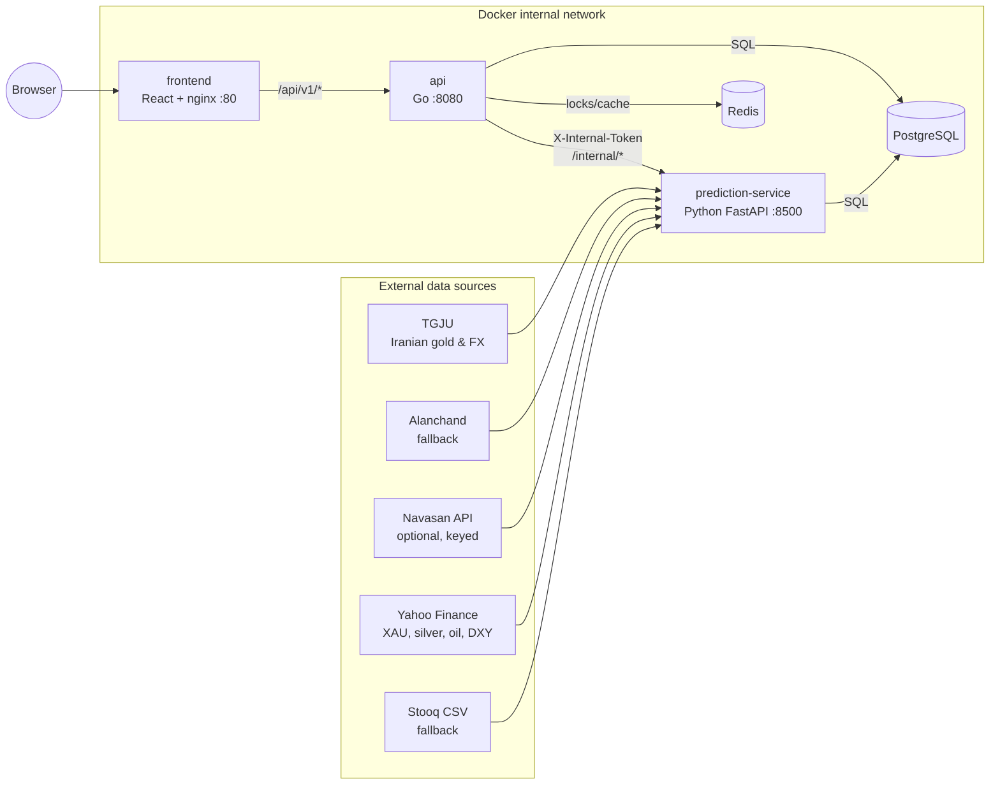
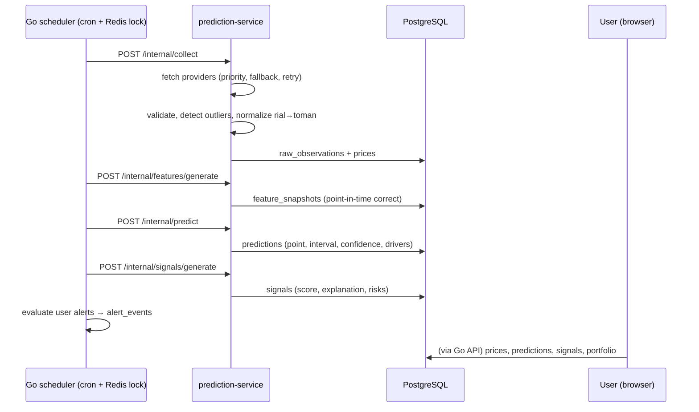
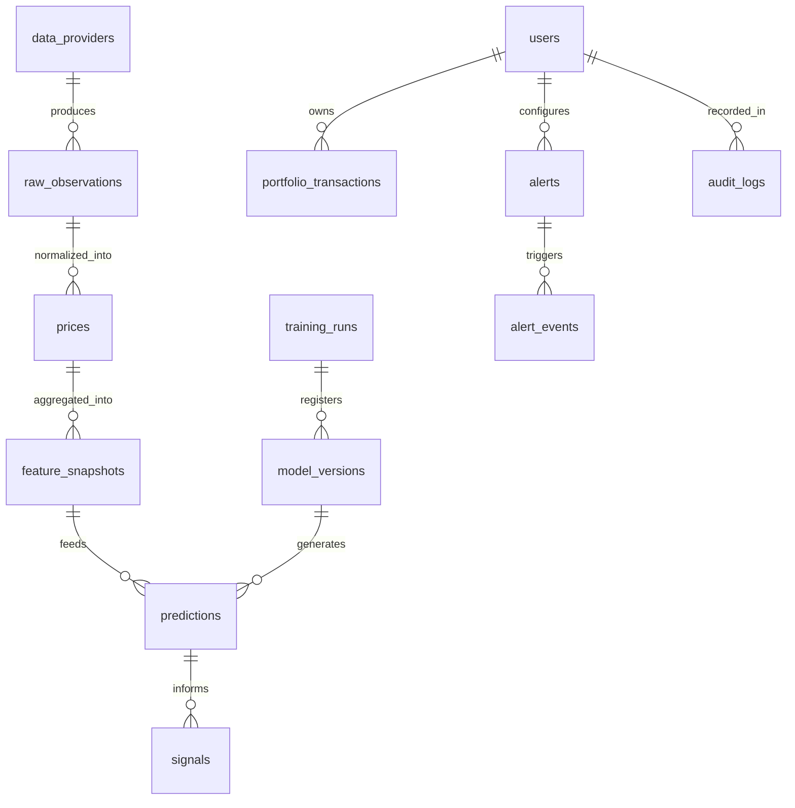

# Architecture Overview

Iran Gold Predictor is a decision-support and analytics system for Iranian 18-karat gold. It is **not** a trading system and does not guarantee outcomes.

## High-level design

## Components

| Service | Language | Responsibility |
|---|---|---|
| `api` | Go | Public REST API, JWT auth, portfolio, alerts, technical indicators, DB migrations at startup, cron scheduler with Redis distributed locks |
| `prediction-service` | Python | Data providers with fallback, normalization & validation, gold formula, feature engineering, model training/selection (walk-forward), predictions with intervals, backtesting, signal generation |
| `frontend` | React + Vite | Dashboard (Overview, Forecast, Technical, Drivers, Portfolio, Alerts, Models); nginx serves static files and proxies `/api/` |
| `postgres` | — | Persistent store: prices, features, models, predictions, signals, users, portfolio, alerts, audit |
| `redis` | — | Distributed job locks, coordination |

Both services still expose `/metrics` (Go) and `/internal/metrics` (Python) in Prometheus text format on the internal network, so a metrics stack can be pointed at them later without code changes — none is deployed by default.

## Data flow

Key properties:

- **Go never computes forecasts**; it reads what Python wrote to Postgres, so user requests are fast and independent of model latency.
- **Python is never exposed publicly**; only the Go service can reach it, authenticated with `INTERNAL_API_TOKEN`.
- **Only one scheduler instance runs a job at a time** — each job takes a Redis `SET NX PX` lock (`lock:job:<name>`), so extra `api` replicas are safe.
- **Migrations** run automatically when `api` starts (golang-migrate, files from `database/migrations/`); `prediction-service` waits for `api` to be healthy.

## Database model (summary)

See `database/migrations/` for authoritative DDL.

Time-series tables (`prices`, `raw_observations`, `predictions`) carry composite indexes on `(symbol, observed_at DESC)`-style keys. TimescaleDB was considered and rejected for now: at one row per symbol per 10 minutes (~50k rows/symbol/year) plain B-tree indexes are more than sufficient, and avoiding the extension keeps deployment simple. The migration path is documented in `docs/limitations.md`.

## Why this shape

- Separating collection/ML (Python) from serving (Go) lets each use its best ecosystem and fail independently — if the model service dies, prices and portfolio still work, and staleness is surfaced honestly rather than hidden.
- All cross-service state goes through Postgres, making every prediction and signal auditable and replayable (`feature_snapshots` records exactly what a model saw).
